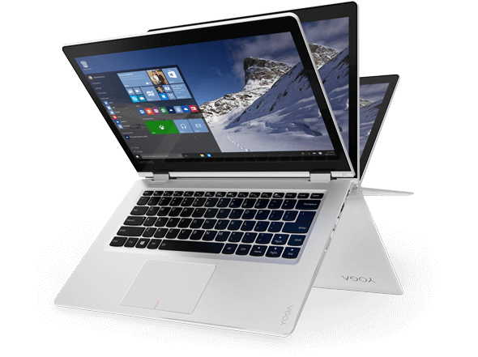

 

## Configuración

| Especificaciones    |                                            |
| ------------------- | -------------------------------------------|
| Modelo              | Lenovo YOGA 510-14ISK                        |
| CPU                 | Intel Core i5-7200U                        |
| Memoria             | 4GB                                        |
| IGPU                | Intel HD Graphics 620                     |

## Versiones soportadas

| MacOS               | Descarga                                   |  
| ------------------- | -------------------------------------------
| macOS Big Sur       |  <a href="https://github.com/daviiid99/Acer-Aspire-E5-571G/releases/tag/11.1">11.1</a>|
